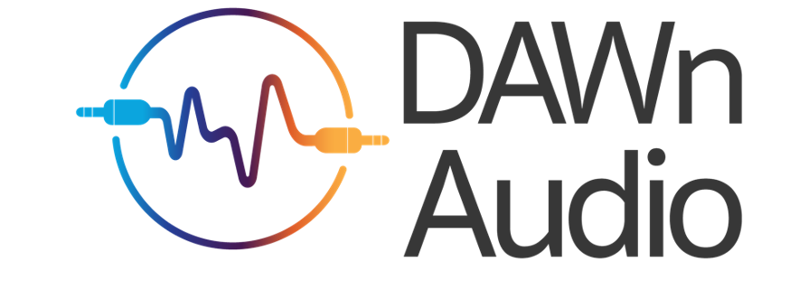

Dawn Audio's Audio Stream Plugin.
This is forked from [Pamplejuce](https://github.com/sudara/pamplejuce) by Sudara.... 


To Build this Plugin: 

* MAC && CLION: 

```
mkdir path-to-workspace
cd path-to-workspace
git clone --recursive git@github.com:DAWn-Audio/Plugin.git rpo
mkdir bld
cd bld
```

If using CLION:

```
/Applications/CLion.app/Contents/bin/cmake/mac/bin/cmake -DCMAKE_BUILD_TYPE=Debug -DCMAKE_MAKE_PROGRAM=/Applications/CLion.app/Contents/bin/ninja/mac/ninja -GNinja -DRTP_BACKEND=uvgRTP -S ../rpo -B .
ninja -j 10
```

If using XCODE:

```
cmake -S ../rpo -B . -GXcode

xcodebuild -project project.xcodeproj -scheme "DAWNAUDIOPLUGIN" -target "DAWNAUDIO_VST3" -configuration Debug build

```


